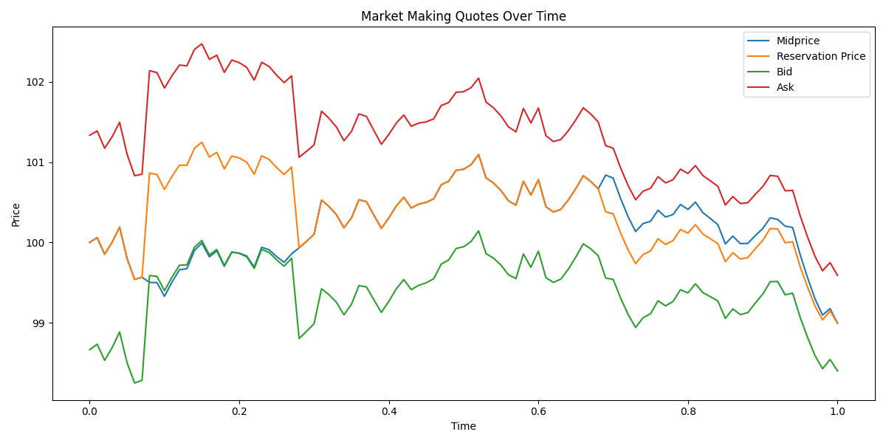
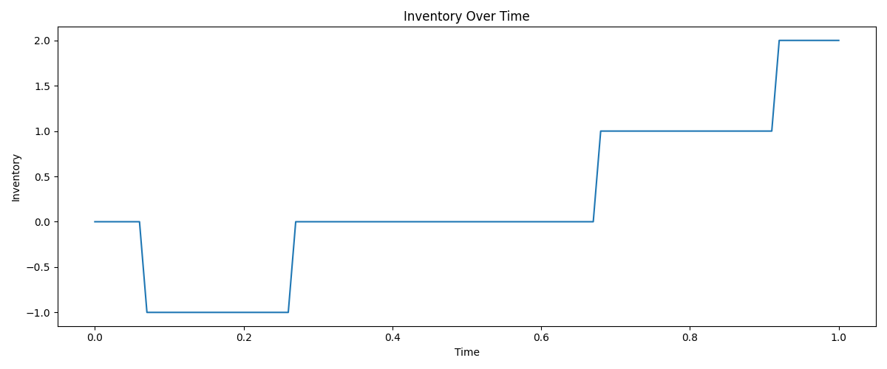
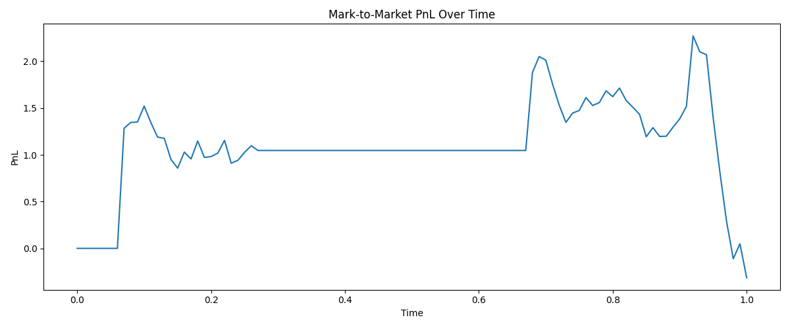
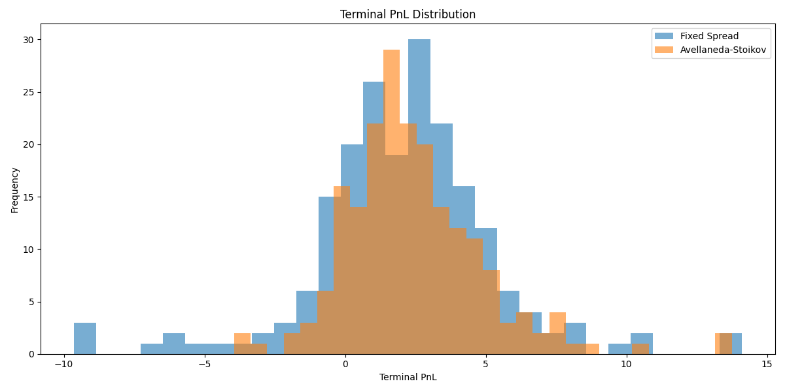
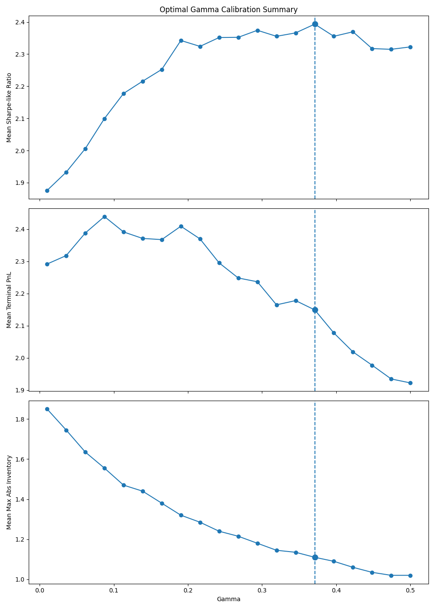

# Market Making Simulation Engine

A Python simulation framework for studying inventory-aware market making strategies under stochastic price dynamics and probabilistic order flow.

This project implements and evaluates the Avellaneda–Stoikov market making model, comparing it to a baseline fixed-spread strategy using Monte Carlo simulation, parameter sensitivity analysis, and calibration of the risk-aversion parameter γ.

Project Motivation

Market makers provide liquidity by continuously quoting bid and ask prices.
Their profitability comes from capturing the bid–ask spread, but they must also manage inventory risk when market orders accumulate on one side.

Key challenges include:
	•	balancing spread capture vs execution probability
	•	controlling inventory exposure
	•	adapting quotes to market volatility and order flow
	•	maintaining stable risk-adjusted profitability

This project simulates these dynamics to evaluate market making strategies quantitatively.

⸻

Model Overview

Midprice Dynamics

The midprice follows an arithmetic Brownian motion:

S_{t+\Delta t} = S_t + \mu \Delta t + \sigma \sqrt{\Delta t} Z_t

where:
	•	\mu = drift
	•	\sigma = volatility
	•	Z_t \sim N(0,1)

⸻

Order Arrival Model

Market orders arrive with exponential intensity depending on the distance from the midprice:

\lambda(\Delta) = A e^{-k \Delta}

where:
	•	A = baseline order flow intensity
	•	k = sensitivity to quote distance
	•	\Delta = distance between quote and midprice

Fill probabilities are computed via a Poisson arrival model:

P(\text{fill}) = 1 - e^{-\lambda \Delta t}

⸻

Market Making Strategies

Fixed Spread Strategy

Quotes a constant symmetric spread around the midprice:

bid = S_t - \frac{s}{2}, \quad ask = S_t + \frac{s}{2}

This serves as a benchmark.

Avellaneda–Stoikov Strategy

Inventory-aware quoting based on the reservation price:

r_t = S_t - q_t \gamma \sigma^2 (T - t)

where:
	•	q_t = inventory
	•	\gamma = inventory risk aversion
	•	\sigma = volatility
	•	T-t = time remaining

The optimal spread is approximated as:

\delta_t = \gamma\sigma^2(T-t) + \frac{2}{\gamma}\ln\left(1+\frac{\gamma}{k}\right)

Quotes are then:

bid = r_t - \frac{\delta_t}{2}, \quad ask = r_t + \frac{\delta_t}{2}

This shifts quotes to encourage inventory rebalancing.

Simulation Framework

The engine simulates:
	•	stochastic midprice evolution
	•	dynamic bid/ask quoting
	•	probabilistic order fills
	•	inventory accumulation
	•	mark-to-market PnL

At each time step:
	1.	update midprice
	2.	compute strategy quotes
	3.	simulate order arrivals
	4.	update inventory and cash
	5.	compute mark-to-market PnL

⸻

Experiments

The project includes several research experiments.

1. Strategy Comparison

Compares:
	•	Fixed Spread Market Maker
	•	Avellaneda–Stoikov Strategy

Metrics analyzed:
	•	terminal PnL
	•	PnL volatility
	•	maximum inventory exposure
	•	total fills
	•	risk-adjusted performance

Result:
The inventory-aware strategy reduces inventory risk while maintaining competitive profitability.

⸻

2. Monte Carlo Simulation

Both strategies are evaluated across 200 simulated market scenarios.

Example metrics:
Metric
Fixed Spread
Avellaneda–Stoikov
Mean Terminal PnL
~2.07
~2.45
PnL Std Dev
~3.27
~2.49
Max Inventory
~2.26
~1.52
Sharpe-like Ratio
~1.60
~2.16

Conclusion:

The Avellaneda–Stoikov model improves risk-adjusted performance and inventory stability.

3. Parameter Sensitivity Analysis

The simulator evaluates strategy performance under varying parameters:
	•	γ (inventory risk aversion)
	•	σ (volatility)
	•	A (order flow intensity)
	•	k (execution sensitivity)
	•	base spread

These experiments analyze how market conditions affect:
	•	profitability
	•	inventory exposure
	•	execution dynamics

⸻

4. Optimal Gamma Calibration

A Monte Carlo calibration was performed to determine the optimal risk-aversion parameter γ.

Gamma grid:

\gamma \in [0.01, 0.50]

The optimal value maximizes a risk-adjusted objective (Sharpe-like ratio).

Result: Optimal γ ≈ 0.37

At this value:
	•	inventory risk is significantly reduced
	•	risk-adjusted profitability is maximized
	•	trading activity remains sufficient

    
Example Simulation:

## Quote Dynamics

Bid, ask, and reservation prices evolve dynamically with market conditions.

## Inventory Evolution

Inventory fluctuates but remains controlled due to reservation price adjustments.

## PnL Path

The market maker captures spread profits while managing inventory risk.

## Monte Carlo Results

Terminal PnL distribution across simulations:

## Optimal Gamma Calibration

Risk-adjusted performance vs γ:

market-making-simulation
│
├── config.py
├── main.py
│
├── market_maker
│   ├── price_process.py
│   ├── strategy.py
│   ├── order_flow.py
│   ├── simulator.py
│   └── metrics.py
│
├── experiments
│   ├── compare_strategies.py
│   ├── monte_carlo_comparison.py
│   ├── sensitivity_analysis.py
│   └── optimal_gamma_search.py
│
├── outputs
│   ├── figures
│   └── results

Key Takeaways
	•	Inventory-aware quoting significantly reduces risk exposure.
	•	Monte Carlo simulation enables robust evaluation of market making strategies.
	•	Parameter calibration is critical for achieving optimal risk-return tradeoffs.
	•	The Avellaneda–Stoikov framework provides a principled way to balance spread capture and inventory risk.

⸻

Technologies Used
	•	Python
	•	NumPy
	•	Pandas
	•	Matplotlib

⸻

Possible Extensions

Future improvements could include:
	•	multi-asset market making
	•	queue-position modeling in the limit order book
	•	adverse selection and informed order flow
	•	option market making with delta hedging
	•	reinforcement learning for adaptive quoting
